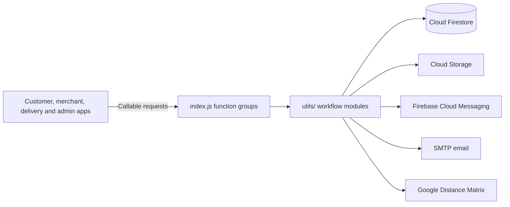

# Laundromat Cloud Functions

The shared Firebase backend for **Laundromat**, my 2021 BSc Software Engineering final-year project at the International Islamic University Islamabad. Its callable functions support the customer, merchant, delivery rider, and admin Android apps: accounts, laundry catalogs, orders, trips, notifications, and shared settings.

## What the backend handles

| Function group | Main responsibilities |
| --- | --- |
| `admin` | Administrator login, registration decisions, service types, user and order retrieval, fare settings, and delivery radius. |
| `customer` | Customer registration and login, profile changes, saved addresses, current location, and messaging token. |
| `merchant` | Merchant registration and login, profile changes, and messaging token. |
| `laundry` | Laundry profile and availability, nearby-laundry lookup, and menu category and item operations. |
| `delivery_boy` and `vehicle` | Rider and vehicle registration, profile updates, availability, current location, and trip-related rider lookup. |
| `order_task` | Order submission, acceptance or decline, cancellation, pickup or return-delivery requests, and status changes. |
| `trip_task` | Trip acceptance or decline, cancellation, start, arrival and handover updates, completion, and trip lookup. |
| `payment` | Update the `isPayed` field on order and trip records. |

`index.js` exports these nine groups. Firebase names their callable endpoints with the group prefix, for example `admin-verifyLogin`, `laundry-addMenuItem`, `order_task-sendOrderRequest`, and `trip_task-confirmDelivery`.

## Order and delivery flow

1. A customer submits an order through `order_task-sendOrderRequest`. The backend stores it, links it to the customer and laundry, and sends the merchant a notification and email.
2. The merchant accepts or declines the order. For an accepted order, `order_task-sendPickupRequest` creates a `PICKUP` trip, finds nearby riders, and sends trip requests.
3. A rider accepts a trip, starts it, confirms arrival at the source, collects the items, and confirms arrival and delivery at the destination. The functions update trip and order records and notify the relevant apps.
4. After the laundry marks the order washed, the merchant requests a `DELIVERY` trip for the return journey. The same trip functions handle its rider assignment and handovers.
5. The backend records related customer, merchant, and rider transactions during the handover flow. The `payment` group updates paid flags on order and trip records; the customer app handles JazzCash requests.

Merchant and rider registrations first enter pending Firestore collections. An administrator can accept or decline them; acceptance moves the approved records into the active merchant/laundry or rider/vehicle collections. Email and Firebase Cloud Messaging accompany several registration, order, and trip events.

## Architecture



The files in `cloud_functions/` define callable entry points and pass request data to modules in `utils/`. Those modules perform Firestore reads and writes, upload registration and catalog images to Cloud Storage, calculate driving distance, and send FCM and email messages. The Android apps call the functions directly through the Firebase Functions SDK.

### Repository layout

```text
index.js                    Firebase Admin initialization and function-group exports
cloud_functions/
  admin.js                  Registration review, settings, and admin queries
  customer.js               Customer account and address operations
  merchant.js               Merchant account operations
  laundry.js                Laundry profile and catalog operations
  delivery_boy.js           Rider account, availability, and location operations
  vehicle.js                Vehicle validation and updates
  order_task.js             Order lifecycle operations
  trip_task.js              Rider trip lifecycle operations
  payment.js                Paid-flag updates
utils/
  *_utils.js                Firestore workflows, validation, notifications,
                            image upload, distance, and email helpers
package.json                Node runtime, dependencies, and Firebase CLI scripts
package-lock.json           Locked dependency tree from the original project
```

Firestore collections used by the source include `customers`, `merchants`, `laundries`, `delivery_boys`, `vehicles`, `orders`, `trips`, `admin`, and `emails`, along with pending-registration collections. The admin document supplies fare and delivery-radius settings consumed by the apps.

## Configuration and use

The repository declares **Node.js 14** and the original 2021 package versions. It uses `firebase-functions`, `firebase-admin`, `nodemailer`, and `google-distance-matrix`. Use a compatible environment for this historical source.

1. Install the locked dependencies with `npm ci`.
2. Configure a Firebase project with Cloud Functions, Firestore, Cloud Storage, and Cloud Messaging. Point the Firebase CLI `functions.source` setting to this repository.
3. Provide the project-specific Cloud Storage bucket, admin-document reference, Distance Matrix API key, and SMTP sender and authentication settings used by `index.js`, `utils/image_utils.js`, `utils/admin_utils.js`, `utils/location_utils.js`, and `utils/email_utils.js`. Supply the admin record and settings in Firestore.
4. Use the Firebase CLI scripts in `package.json` from the configured project: `npm run serve` for the Functions emulator, `npm run shell` for the Functions shell, `npm run deploy` for deployment, and `npm run logs` for logs.

The functions expect the Firestore records and input shapes used by the companion Android apps. Image upload uses base64 image data and stores JPEG files in the configured bucket. Driving-distance calculations use the Google Distance Matrix service.

## Related repositories

- [Customer app](https://github.com/taymoor-ghazanfar/laundromat-customer) — laundry discovery, booking, and order tracking.
- [Merchant app](https://github.com/taymoor-ghazanfar/laundromat-merchant) — catalog and order management.
- [Delivery app](https://github.com/taymoor-ghazanfar/laundromat-delivery) — trip requests, navigation, and handovers.
- [Admin app](https://github.com/taymoor-ghazanfar/laundromat-admin) — approvals and system administration.
- [Cloud Functions](https://github.com/taymoor-ghazanfar/laundromat-cloud-functions) — shared backend operations and notifications (this repository).

## Academic context and license

Developed by **Taymoor Ghazanfar**, supervised by **Dr. Muhammad Nadeem**, International Islamic University Islamabad (2021).

The repository includes an [Apache License 2.0](LICENSE) file.
